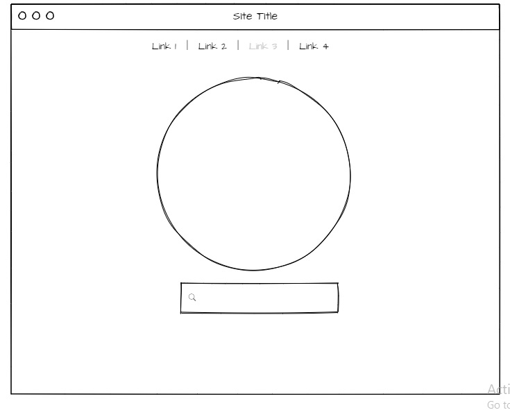
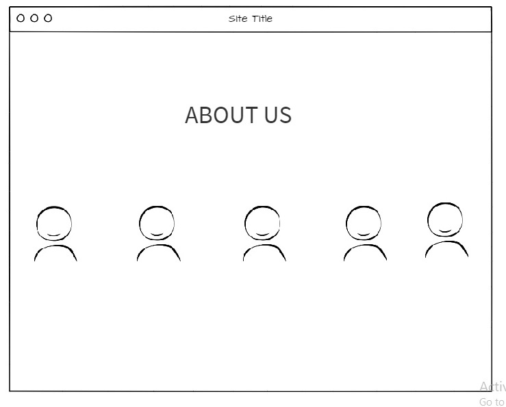
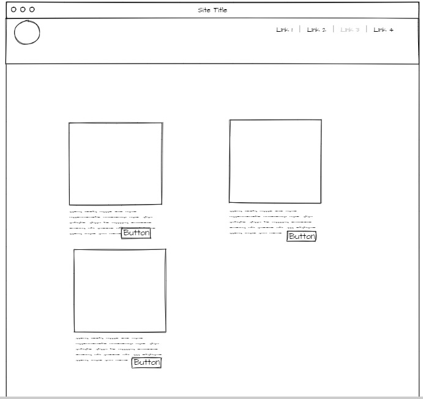
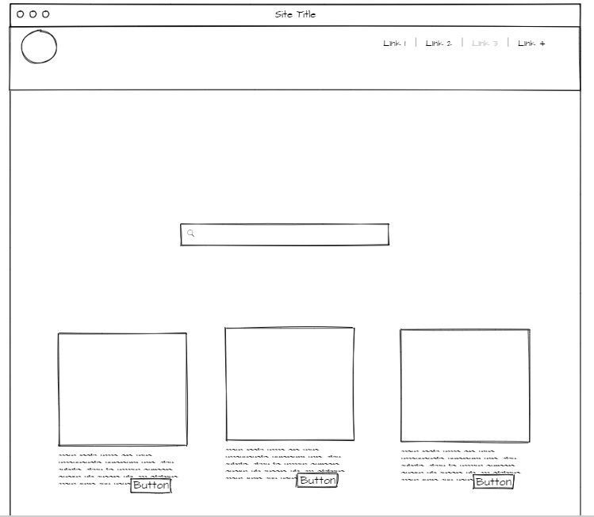
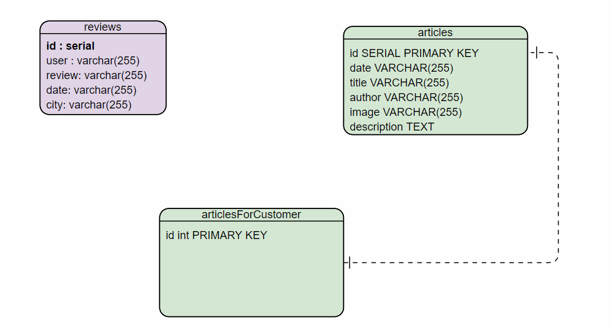

---- This is an alphabetical order, contribution is even ----

- Abdel Hadi Nofal
- Abdullah Al Sawalmeh [Team leader]
- Amarah Ayman
- Ayman Naif
- Tareq yousef

**Summary of idea**: a lead website for any person want to fly to certain city.

**What problem or pain point does it solve?** it is recommeneded to know all the details about the city that you want to travel on, like the weather status, available hotels, places to visit, users openions ... etc, our application provide those details.

# dream-and-fly

## WireFrame

## MVP

## DB ERD

## User Stories

1- as a user, I would like to have a shared head, header and footer, between all website pages, so the website gives the feeling of professionality
2- as a user, I would like to have a homepage, that contians searchbar and a nice UI so it incourges visitors to travel.
3- as a user, I would like the user when clicks on the searchbar in the homepage, another page is opened which contains alot of details about the country the user wants to travel to, so the user get a lot of infos about the destination country.
4- as a user, I would like in the results page, to have a review section, which contains all users reviews about the destination country.
5- as a user, I would like to have a blog section and an admin page, so my employees can post flights article related topics.
